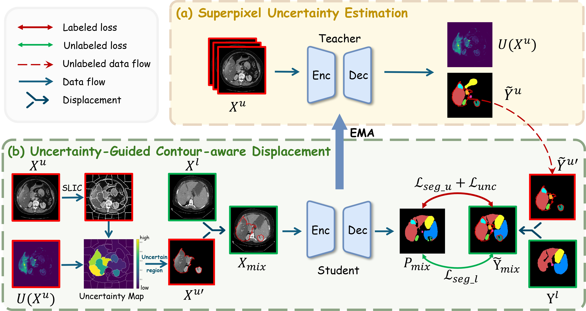

# UCAD: Uncertainty-guided Contour-aware Displacement for semi-supervised medical image segmentation
by Chengbo Ding, Fenghe Tang, and Shaohua Kevin Zhou.

## Introduction
This repo is the official implementation of UCAD: Uncertainty-guided Contour-aware Displacement for semi-supervised medical image segmentation which is submitted to ISBI-2026.


## Requirements
This repository is based on PyTorch 2.4.1, CUDA 12.8 and Python 3.8.20. All experiments in our paper were conducted on an NVIDIA GeForce RTX 4090 GPU with an identical experimental setting.

## Usage
We provide `code` and `model` for ACDC and Synapse dataset.

Data could be got at [ACDC](https://github.com/HiLab-git/SSL4MIS/tree/master/data/ACDC) and [Synapse](https://github.com/xmed-lab/DHC).

**Note:** Please adjust the arguments in these scripts according to specific experimental settings.

To train a model,
```bash
cd code
# You should generate superpixel segments first
python generate_masks_offline.py
# Training
CUDA_VISIBLE_DEVICES=0 python train_UCAD.py
```

To test a model,
```bash
CUDA_VISIBLE_DEVICES=0 python eval.py
```


## Acknowledgements
Our code is largely based on [BCP](https://github.com/DeepMed-Lab-ECNU/BCP). Thanks for these authors for their valuable work, hope our work can also contribute to related research.


## Questions
If you have any questions, welcome contact me at 'dingchengbo@mail.ustc.edu.cn'

